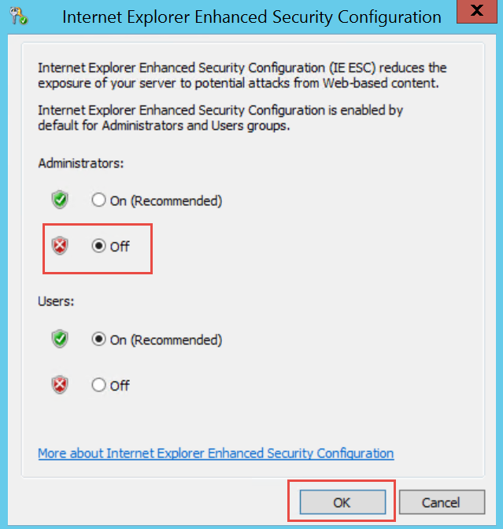
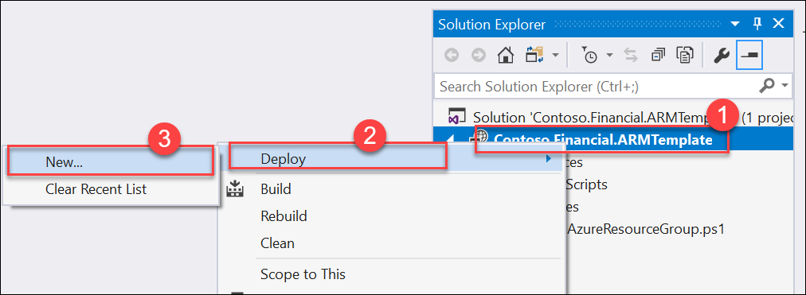
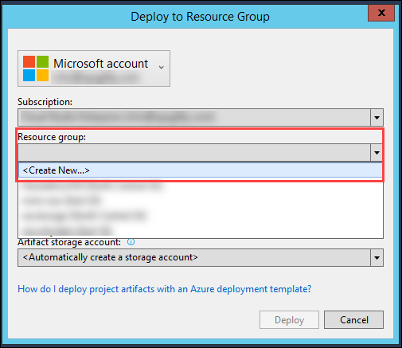
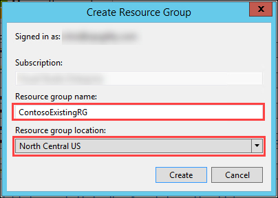
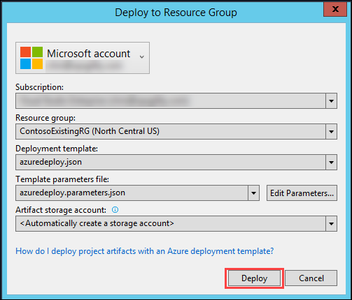
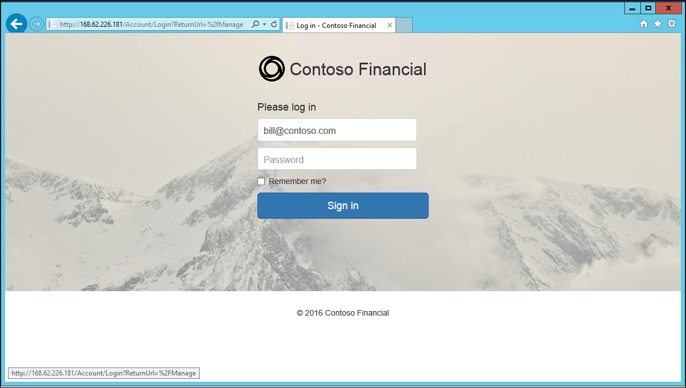
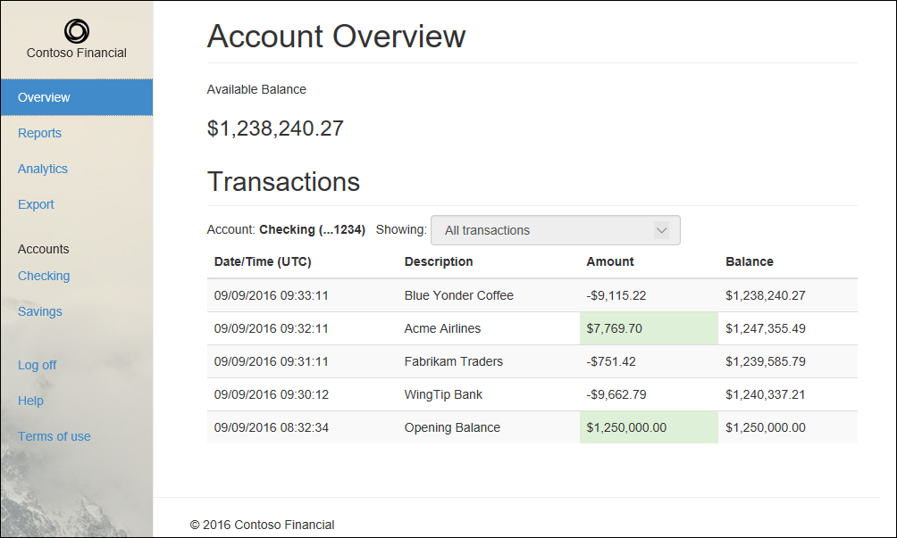

Optimized architecture

Before the hands-on lab setup guide

December 2018

Information in this document, including URL and other Internet Web site references, is subject to change without notice. Unless otherwise noted, the example companies, organizations, products, domain names, e-mail addresses, logos, people, places, and events depicted herein are fictitious, and no association with any real company, organization, product, domain name, e-mail address, logo, person, place or event is intended or should be inferred. Complying with all applicable copyright laws is the responsibility of the user. Without limiting the rights under copyright, no part of this document may be reproduced, stored in or introduced into a retrieval system, or transmitted in any form or by any means (electronic, mechanical, photocopying, recording, or otherwise), or for any purpose, without the express written permission of Microsoft Corporation.

Microsoft may have patents, patent applications, trademarks, copyrights, or other intellectual property rights covering subject matter in this document. Except as expressly provided in any written license agreement from Microsoft, the furnishing of this document does not give you any license to these patents, trademarks, copyrights, or other intellectual property.

The names of manufacturers, products, or URLs are provided for informational purposes only and Microsoft makes no representations and warranties, either expressed, implied, or statutory, regarding these manufacturers or the use of the products with any Microsoft technologies. The inclusion of a manufacturer or product does not imply endorsement of Microsoft of the manufacturer or product. Links may be provided to third party sites. Such sites are not under the control of Microsoft and Microsoft is not responsible for the contents of any linked site or any link contained in a linked site, or any changes or updates to such sites. Microsoft is not responsible for webcasting or any other form of transmission received from any linked site. Microsoft is providing these links to you only as a convenience, and the inclusion of any link does not imply endorsement of Microsoft of the site or the products contained therein.

© 2018 Microsoft Corporation. All rights reserved.

Microsoft and the trademarks listed at <https://www.microsoft.com/en-us/legal/intellectualproperty/Trademarks/Usage/General.aspx> are trademarks of the Microsoft group of companies. All other trademarks are property of their respective owners.# Optimized Architecture setup

**Contents**

<!-- TOC -->

- [Optimized architecture before the hands-on lab setup guide](#optimized-architecture-before-the-hands-on-lab-setup-guide)
  - [Requirements](#requirements)
  - [Before the hands-on lab](#before-the-hands-on-lab)
    - [Task 1: Create a virtual machine for your lab environment](#task-1-create-a-virtual-machine-for-your-lab-environment)
    - [Task 2: Disable IE Enhanced Security](#task-2-disable-ie-enhanced-security)
    - [Task 3: Download the Sample App Files](#task-3-download-the-sample-app-files)
    - [Task 4: Deploy Sample App and "Existing" environment](#task-4-deploy-sample-app-and-%22existing%22-environment)

<!-- /TOC -->

# Optimized architecture before the hands-on lab setup guide 

## Requirements

1. Microsoft Azure subscription
2. Local machine or a virtual machine configured with Visual Studio 2017 Community Edition or better.

## Before the hands-on lab

Duration: 20 minutes

In this exercise, you will set up an environment to use for the rest of the exercises.

### Task 1: Create a virtual machine for your lab environment

1. Launch a browser using Incognito or InPrivate mode, and navigate to <https://portal.azure.com>. Once prompted, login with your Microsoft Azure credentials. If prompted, choose whether your account is an organization account a Microsoft Account.

2. Click **+ Create a resource**, and in the search box, type in *Visual Studio Community 2017*, and press enter. Click the Visual Studio Community 2017 image running on Windows Server 2016 and with the latest update.

3. In the returned search results, click the image name.

    

4. In the Marketplace solution blade, click **Create**.

5. Set the following configuration on the Basics tab:

    - Subscription: **If you have multiple subscriptions choose the subscription to execute your labs in**.
    - Resource Group: **OPSLABRG**
    - Name: **LABVM**
    - Region: **Choose the closest Azure region to you**.
    - Size: choose **D2\_V3 Standard**
    - User name: **demouser**
    - Password: **demo@pass123**

6. Be sure to configure the **Inbound Port Rules** to allow connected on inbound port **RDP (3389)**, then click **Review + create**. Opening the inbound port 3389 is necessary so that you can connect to the Windows VM with Remote Desktop after it's provisioned.

7. On the Validation step, click **Create**. The deployment should begin provisioning. It may take more than 10 minutes for the virtual machine to complete provisioning.

### Task 2: Disable IE Enhanced Security

> **Note:** Sometimes this image has IE ESC disabled, sometimes it does not.

1. On the new VM you just created, open an RDP session and click the **Server Manager** icon.

    

2. Click **Local Server**.

    

3. On the right side of the pane, click **On** by IE Enhanced Security
    Configuration.

    

4. Change to **Off** for Administrators, and click **OK**.

    

### Task 3: Download the Sample App Files

1. Create a new folder on your **C:\\** drive named **HOL** (**C:\\HOL**).

2. Download the sample application and ARM template
    (optimized-architecture-student.zip) from here:

    <https://cloudworkshop.blob.core.windows.net/optimized-architecture/OptimizedArchitecture-StudentFiles-6-2017.zip>

3. Right click on the downloaded .zip file, and click **Properties**. On the properties pane, check **Unblock** to ensure the files are marked safe.

4. Extract the zip file contents to the **C:\\HOL** folder.

5. From the **ARMTemplate** folder under **C:\\HOL**, open the Visual Studio Solution file: **Contoso.Financial.ARMTemplate.sln**.

### Task 4: Deploy Sample App and "Existing" environment

1. From the **C:\\HOL\\ARMTemplate** folder, open the Visual Studio Solution: **Contoso.Financial.ARMTemplate.sln**.

2. In the **Solution Explorer** window, right-click on the **Contoso.Financial.ARMTemplate** project, click **Deploy**, and then click **New...**

    

3. If your Microsoft or Organization account for your Azure Subscription has not been added to Visual Studio yet, click on **Add an account**, then **Add an account...**, and follow the prompts to login.

    

4. Click on the **Resource group** dropdown, followed by selecting **Create New...**.

    

5. On the **Create Resource Group** dialog, enter the following values:

    - Resource group name: **ContosoExistingRG**
    - Resource group location: **North Central US (If your subscription allows this, otherwise pick a subscription where you are allowed to deploy to.)**

    

6. Click the **Create** button.

7. In the **Deploy to Resource Group** dialog, click the **Deploy** button to deploy the ARM Template to the newly created Resource Group.

    

8. Deployment status of the ARM Template will be displayed in the **Output** window within Visual Studio.

    

    > **Note**: It can take up to 15 minutes for the template to fully deploy.

9. Once the deployment has completed successfully, the **IP Address** and **FQDN** of the External / Internet Load Balancer for the Web App tier will be displayed in the output window.

    

    >**Note**: The **Username** and **Password** for the VMs and SQL Database created by the ARM Template are:
    > - Username: **demouser**
    > - Password: **demo@pass123**

10. Open a *new* web browser window and navigate to the Web App tier using the **Internet Load Balancer IP Address**.

    

11. To login to the Web App Tier of the Contoso Financial sample application, simply enter **any email address and password** followed by clicking on **Sign in**. If you can't immediately sign in, give the site a few minutes to run the background process and then attempt to sign in again.

    >**Note**: If any email address does not work then leave the default email address which is *bill@contoso.com* and put any password.

12. Once logged in, the sample application will display a simple **Account Transaction** ledger.

    

Leaving the browser open to the Account Overview page will automatically load new transactions as they are generated by the background process, since the web page has a JavaScript timer that checks for new transactions periodically.

You should follow all steps provided *before* attending the Hands-on lab.
